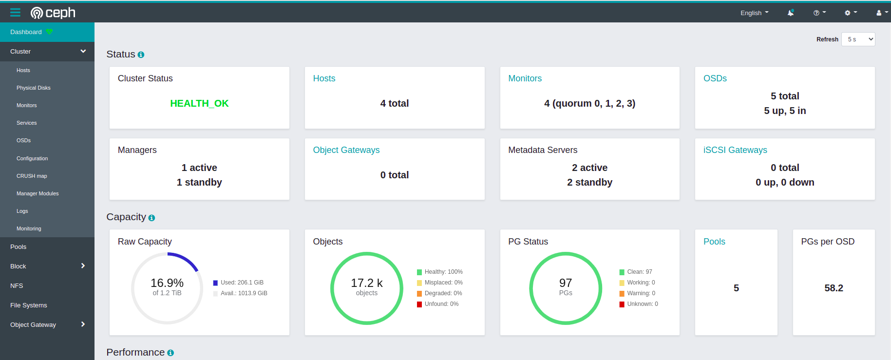

# Create a ceph cluster in 20 minutes

> *Insecure by design* Demonstration only.

- understand the components of ceph by manually building a cluster
- create and mount a CephFS filesystem
- Add/remove disks
- Add/remove hosts
- Adding a disk automatically increases avalable storage




# 1. Create 3 vultr VPS servers

Server requirements:

- ubuntu 20 LTS

or use this script: https://github.com/KarmaComputing/high-availability-web-services/blob/8-storage/vultr/vultr-create-n-servers.sh

```
./vultr/vultr-create-n-servers.sh 3 vhp-1c-2gb-intel lhr
```
> DO NOT USE THE delete servers script


# 2. Install `podman` and `cephadm`

- podman
- cephadm
- See [network config reference](https://docs.ceph.com/en/latest/rados/configuration/network-config-ref/)

> **Warning** This disables the firewall by default during installation


```

# Disable firewall
ufw disable
systemctl stop ufw

# Install podman

apt-get update -y

source /etc/os-release
sh -c "echo 'deb http://download.opensuse.org/repositories/devel:/kubic:/libcontainers:/stable/xUbuntu_${VERSION_ID}/ /' > /etc/apt/sources.list.d/devel:kubic:libcontainers:stable.list"

wget -nv https://download.opensuse.org/repositories/devel:kubic:libcontainers:stable/xUbuntu_${VERSION_ID}/Release.key -O- | apt-key add -

apt-get update -qq -y
apt-get -qq --yes install podman


podman --version
```

### Centos instal 
ref 
```
#centos dying =/  https://forketyfork.medium.com/centos-8-no-urls-in-mirrorlist-error-3f87c3466faa
sudo sed -i -e "s|mirrorlist=|#mirrorlist=|g" /etc/yum.repos.d/CentOS-*
sudo sed -i -e "s|#baseurl=http://mirror.centos.org|baseurl=http://vault.centos.org|g" /etc/yum.repos.d/CentOS-*

sudo dnf config-manager --set-enabled powertools
dnf --disablerepo '*' --enablerepo=extras swap centos-linux-repos centos-stream-repos


sudo yum -y install podman

dnf install -y python3
```


### Install `cephadm`

```
curl --silent --remote-name --location https://github.com/ceph/ceph/raw/quincy/src/cephadm/cephadm

chmod +x cephadm


./cephadm add-repo --release quincy

./cephadm install

cephadm install ceph-common

ceph -v
```


# 3. Bootstrap the first ceph host

```
cephadm bootstrap --mon-ip *<mon-ip>*
```

> Remember to copy the dashboard login/password to your password manager.

At this stage ceph has one node with no disks and must have additional nodes join, and then disks added.

```
ceph status
```

## Connect hosts togeather so `cephadm` can setup between hosts:

Ceph boostrap creates a file `/etc/ceph/ceph.pub`, and that needs to be copied accross to every host.


From the bootstrapped host: Copy the `/etc/ceph/ceph.pub` file over:

e.g
```
ssh-copy-id -f -i /etc/ceph/ceph.pub root@ceph-b
```
(to every other vps)

## Adding hosts

From the first host, add each of the hosts to the cluster by using `ceph orch host add` and applying the `_admin` label.


e.g: 
```
ceph orch host add ceph-b <host-ip> _admin
```

### list hosts

```
root@ceph-a:~# ceph orch host ls
HOST    ADDR             LABELS  STATUS  
ceph-a  <ip>  _admin          
ceph-b  <ip>   _admin          
2 hosts in cluster
```

> Note the `STATUS` column is blank. This may be a bug?


# 4. Add monitors

> [Read about what ceph monitor are](https://docs.ceph.com/en/quincy/start/intro/)

Because this is a *thrifty* demo cluster, each ceph node is on it's own network. This is largely indefensible; usually you'd put your ceph cluster behind another layer.

Since each node is on it's own network we need to tell ceph to use `--unmanaged` monitor placments - meaning we're going to place and start them. Usually ceph automatically starts/stops monitors based on your network subnets, but since each host is on its own public ip, we must give the full /32 address and can't use the nice automatic approach.


Manual management of monitor placement

## Put mons in manual management mode:

```
ceph orch apply mon --unmanaged
```

Add each monitor: (every host has 1 monitor in our setup)

```
ceph orch daemon add mon *<host1:ip-or-network1/32>
```

e.g.
```
root@ceph-a:~# ceph orch daemon add mon ceph-b:<ip-addr>/32
Deployed mon.ceph-b on host 'ceph-b'

root@ceph-a:~# ceph orch daemon add mon ceph-c:<ip-addr>/32
Deployed mon.ceph-c on host 'ceph-c'
```

# 5. Adding OSDs from disks


Add a volume (block) to each of the servers and attach it, without any formatting.

This tells ceph to 'look' for blank disks/volumes and will 
automatically start using them/adding them to the storage
pool.
```
ceph orch device ls
ceph orch apply osd --all-available-devices
```

### Create a CephFS
https://docs.ceph.com/en/latest/cephadm/services/mds/#orchestrator-cli-cephfs

```
ceph fs volume create myfs
```

## Access web dashboard

	     URL: https://41dbb9cb-9c1a-4682-a9de-f8a14ec52488:8443/
	    User: admin
	Password: secret


## Where did my dashboard go? Dashboard crashed / restart dashboard

> tldr: Your ceph dashboard has changed IP address because it has automatically moved to another node. Confusing I know

https://documentation.suse.com/ses/7.1/html/ses-all/bp-troubleshooting-dashboard.html
```
ceph mgr services | grep dashboard
```

## Ceph how to change reset admin dashboard password

1. Login to one of the ceph servers with `_admin` label
2. Create a file containing the new password you want for `admin` user
3. Apply the new password using:

```
ceph dashboard ac-user-set-password admin -i filename
```

# 6. connecting a ceph client ubuntu host

src: https://docs.ceph.com/en/quincy/cephfs/mount-prerequisites/


## on client host setup mount point

Client needs to understand ceph:

```
apt install ceph-common
```

Create authentication so client can mount the Cephfs

```
mkdir -p -m 755 /etc/ceph
ssh root@<ip> "sudo ceph config generate-minimal-conf" | sudo tee /etc/ceph/ceph.conf
```

perms
```
sudo chmod 644 /etc/ceph/ceph.conf
```

Create a CephX user and get its secret key:


```
ssh root@<ip> "sudo ceph fs authorize myfs client.ceph-client-a / rw" | sudo tee /etc/ceph/ceph.client.ceph-client-a.keyring
```

### Mount the cephfs
successful mount example:

```
mount -t ceph <ip>:/ /mnt/myfs/ -o name=ceph-client-a,secret=sfgdhjhgsfsgdhfjg==
```

# Day 2

## User mangement

https://docs.ceph.com/en/latest/rados/operations/user-management/#managing-users

### Show me all users:

```
ceph auth ls
```

### Get individual user:
```
ceph auth get client.bob
```

## Adding another filesystem Cephfs multiple filesystems
https://docs.ceph.com/en/quincy/cephfs/createfs/


You can create a new filesystem with a simple:

```
ceph fs volume create myfs
```
Where `myfs` is the name of the filesystem you want to create.


> **NOTE** In older versions of ceph, there were more steps to create a new cephfs. They are no longer requried.

Older versions of ceph:
```
ceph osd pool create cephfs.myfs_data cephfs.myfs_meta

ceph osd pool ls
```

Create the new filesystem , attached to the new pools:

```
ceph fs new myfs cephfs.myfs_data cephfs.myfs_meta
```


# Notes 

### list all components
```
cephadm ls
```

### Add another host steps

- install podman
- update ssh config on an admin/all nodes
- copy ssh key
- copy ceph key:
	ssh-copy-id -f -i /etc/ceph/ceph.pub root@ceph-x
- go onto another existing ceph _admin node and add new host

### Useful

list hosts:
root@ceph-a:~# ceph orch host ls

ceph orch host add <host-name> <host-ip> _admin
e.g.
ceph orch host add ceph-d <ip> _admin

add monitor on new hosts if want to

e.g. (from another already live ceph node)
ceph orch daemon add mon ceph-d:<ip>/32


### What's the status of my filesystem(s)
```
ceph fs status
```

### How do I set the default filesystem name?
```
ceph fs set-default cephfs
```

# Observations
Highest IOps seen on Vultr: 243 input/outs 


# Clear crashes
src https://forum.proxmox.com/threads/health_warn-1-daemons-have-recently-crashed.63105/


ceph crash ls

# to fix

Jul  3 16:40:17 ceph-d ceph-mon[47267]: Filtered out host ceph-b: does not belong to mon public_network (<ip>/23)
Jul  3 16:40:17 ceph-d ceph-mon[47267]: Filtered out host ceph-c: does not belong to mon public_network (<ip>/23)

Turn off managed mode.  
https://tracker.ceph.com/issues/52881


# Hw fixed could not mount seccond filesysytem:

```
ceph fs dump
```
1. look at output identify `mds.xxx` , delete them 
2. e.g. `ceph orch daemon rm mds.myfs.486194e3-e416-4022-892e-abc54891e025.mvdacr`
3. Keep deleting (usually two: active and standby- careful the right filesytem!)
3. ceph auto creates new ones
4. Try mounting again


Look into : subdirectory pinning


Good mounting documentation:

https://docs.ceph.com/en/quincy/cephfs/mount-using-kernel-driver/#mounting-cephfs


source mount path was not specified 
unable to parse mount source

https://www.reddit.com/r/ceph/comments/u4hr81/trouble_mounting_a_2nd_ceph_file_system_on_linux/


# FINALLY

> Mounting good to know: Your ability to mount and, *critically*, which mount options available or not are dictated by your linux kernel version (if using the kernel mount driver approach and not fuse mount (which is slower) see https://docs.ceph.com/en/pacific/cephfs/mount-using-kernel-driver/#which-kernel-version)

Pass `fs` to set filesystem name during mount.

e.g. mount default filesystem: (default filesystem is set on sever using `ceph fs set-default cephfs`)

```
sudo mount -t ceph 192.168.1.1:/ /mnt/myfs/ -o name=ceph-client-b,secret=IJOIPJOPJOPJ==
```

e.g. mount spesific filesystem by name: Must pass option `fs`

```
sudo mount -t ceph 192.168.1.1:/ /mnt/myfs/ -o name=ceph-client-d,secret=IJOIPJOPJOPJ==,mds_namespace=cephfs
```

Success:


```
df  -h
192.168.1.1:/  219G   84G  135G  39% /mnt/myfs
192.168.1.1:/  136G   64M  135G   1% /mnt/cephfs
```

credit: https://www.reddit.com/r/ceph/comments/u4hr81/comment/i57t4im/?utm_source=share&utm_medium=web2x&context=3

One user multiple filesystems:

https://www.reddit.com/r/ceph/comments/oranq2/cephfs_give_one_user_access_to_multiple/


## Resizing / expanding OSD


1. Expand physical with `pvdisplay`/`pvresize`
2. Then expand logical with `lvdisplay` / `lvresize`

- Expand object
- use pvresize to get pv to 'notice' larger size
- ref https://youtu.be/e0J0gft2jEY?t=371
```
pvdisplay # pv = physical volume display
pvresize /dev/vdb
```

Not done yet, the concept of "locical" volume also needs to be re-sized:

```
lvdisplay

```

e.g. before:

```
  LV Path                /dev/ceph-2f6638b3-9305-4d66-9fd4-9a3d7ae3d8e3/osd-block-426261dd-0f50-4471-8b0b-2f372a86a24b
  LV Name                osd-block-426261dd-0f50-4471-8b0b-2f372a86a24b
  VG Name                ceph-2f6638b3-9305-4d66-9fd4-9a3d7ae3d8e3
  LV UUID                aANcLx-zaVv-LC55-3XjS-WlpS-dAgI-vgSgD9
  LV Write Access        read/write
  LV Creation host, time ec65928b-d432-40bd-be7c-dfa86e067e95, 2022-07-03 20:12:36 +0000
  LV Status              available
  # open                 0
  LV Size                <10.00 GiB
  Current LE             2559
  Segments               1
  Allocation             inherit
  Read ahead sectors     auto
  - currently set to     256
  Block device           253:0

```

> lvdisplay LV Status NOT available?
> If after a rebook the volume has not come back up, it may be brought back available
> with `lvchange -ay /dev/myvg/lv1` see https://access.redhat.com/solutions/4497071

Resizing logical volume:

1. copy path
2. expand logical volume by size increase (in this example we went from 10GB -> 15GB)


The resize command:

```
lvresize -L +5G /dev/ceph-2f6638b3-9305-4d66-9fd4-9a3d7ae3d8e3/osd-block-426261dd-0f50-4471-8b0b-2f372a86a24b
  Size of logical volume ceph-2f6638b3-9305-4d66-9fd4-9a3d7ae3d8e3/osd-block-426261dd-0f50-4471-8b0b-2f372a86a24b changed from <10.00 GiB (2559 extents) to <15.00 GiB (3839 extents).
  Logical volume ceph-2f6638b3-9305-4d66-9fd4-9a3d7ae3d8e3/osd-block-426261dd-0f50-4471-8b0b-2f372a86a24b successfully resized.
```

After resize: Notice we've gone from 10GB to 15GB

```
lvdisplay


  --- Logical volume ---
  LV Path                /dev/ceph-2f6638b3-9305-4d66-9fd4-9a3d7ae3d8e3/osd-block-426261dd-0f50-4471-8b0b-2f372a86a24b
  LV Name                osd-block-426261dd-0f50-4471-8b0b-2f372a86a24b
  VG Name                ceph-2f6638b3-9305-4d66-9fd4-9a3d7ae3d8e3
  LV UUID                aANcLx-zaVv-LC55-3XjS-WlpS-dAgI-vgSgD9
  LV Write Access        read/write
  LV Creation host, time ec65928b-d432-40bd-be7c-dfa86e067e95, 2022-07-03 20:12:36 +0000
  LV Status              available
  # open                 0
  LV Size                <15.00 GiB
  Current LE             3839
  Segments               1
  Allocation             inherit
  Read ahead sectors     auto
  - currently set to     256
  Block device           253:0

```

# How to Remove an OSD / Remoove a host / Drain a host


1. add the `_no_schedule` flag (this will **not** move osds)


e.g. 
```
ceph orch host label add 486194e3-e416-4022-892e-abc54891e025 _no_schedule
```

2. Take out the OSD

> When an OSD is marked `out`, Ceph can begin rebalancing and copying its data to other OSDs.

https://docs.ceph.com/en/latest/rados/operations/add-or-rm-osds/#take-the-osd-out-of-the-cluster

```
osd tree
ceph osd out {osd-num}
# wait for rebalancing...
ceph -w
```


3. Purge the OSD

```
ceph osd purge {osd-num}
```

With caution, you may need to use `--force`.

"DNE" means "Does not exist"
Clean-up `ceph osd tree` output with:

```
ceph osd crush rm osd.2
```

https://medium.com/@george.shuklin/how-to-remove-osd-from-ceph-cluster-b4c37cc0ec87

### How to make OSD recovery faster:

https://www.suse.com/support/kb/doc/?id=000019693

# Loopback file systems with LVM  (WIP)


> This section is less tested. You can (does not mean you should) use `iosetup` and `lvm` to create disks from files. This is useful when, for example, you're running on virtual machines (VPS servers) and ceph cannot detect the disks..

https://ops.tips/blog/lvm-on-loopback-devices/

tldr: (must change size and host name)
```
mkdir -p /var/local/osd/
truncate -s 1500G /var/local/osd/ceph-osd-data-loopbackfile.img
losetup /dev/loop8 /var/local/osd/ceph-osd-data-loopbackfile.img
echo ",,8e,," | sfdisk /dev/loop8
partx --update /dev/loop8
yes | pvcreate /dev/loop8
vgcreate myvg /dev/loop8
lvcreate --size 1450G --name lv1 myvg
ceph orch daemon add osd storage-b:/dev/myvg/lv1
```


Detail:

```
sudo mkdir -p /var/local/osd/
sudo truncate -s 40G /var/local/osd/ceph-osd-data-loopbackfile.img
sudo losetup /dev/loop8 /var/local/osd/ceph-osd-data-loopbackfile.img
lsblk
echo ",,8e,," | sfdisk /dev/loop8
fdisk -l
partx --update /dev/loop8
lvmdiskscan -l
#  WARNING: only considering LVM devices
#  0 LVM physical volume whole disks
#  0 LVM physical volumes

pvcreate /dev/loop8
WARNING: dos signature detected on /dev/loop8 at offset 510. Wipe it? [y/n]: y
  Wiping dos signature on /dev/loop8.
  Physical volume "/dev/loop8" successfully created.
lvmdiskscan -l
#  WARNING: only considering LVM devices
#  /dev/loop8   [      15.00 GiB] LVM physical volume
#  0 LVM physical volume whole disks
#  1 LVM physical volume
vgcreate myvg /dev/loop8
vgdisplay
#  --- Volume group ---
#  VG Name               myvg
#  System ID             
#  Format                lvm2
#  Metadata Areas        1
#  Metadata Sequence No  1
#  VG Access             read/write
#  VG Status             resizable
#  MAX LV                0
#  Cur LV                0
#  Open LV               0
#  Max PV                0
#  Cur PV                1
#  Act PV                1
#  VG Size               <15.00 GiB
#  PE Size               4.00 MiB
#  Total PE              3839
#  Alloc PE / Size       0 / 0   
#  Free  PE / Size       3839 / <15.00 GiB
#  VG UUID               Nn6266-aGWE-pQ7A-e0HX-Hezg-8HhM-0rGSbb
   

lvcreate --size 14G --name lv1 myvg

# use lvdisplay to get the path needed for ceph osd adding
lvdisplay

```


allows:

```
root@servarica-a:~# lsblk 
NAME       MAJ:MIN RM  SIZE RO TYPE MOUNTPOINT
loop0        7:0    0 55.4M  1 loop /snap/core18/2128
loop1        7:1    0 55.5M  1 loop /snap/core18/2409
loop2        7:2    0 61.9M  1 loop /snap/core20/1518
loop3        7:3    0 70.3M  1 loop /snap/lxd/21029
loop4        7:4    0 67.8M  1 loop /snap/lxd/22753
loop5        7:5    0   47M  1 loop /snap/snapd/16292
loop8        7:8    0   40G  0 loop 
├─myvg-lv1 253:0    0   35G  0 lvm  
└─loop8p1  259:1    0   40G  0 part 
sr0         11:0    1 1024M  0 rom  
xvda       202:0    0   80G  0 disk 
├─xvda1    202:1    0    1M  0 part 
├─xvda2    202:2    0    1G  0 part /boot
└─xvda3    202:3    0   79G  0 part /

```

To then add:


```
root@ceph-a:~# lvdisplay 
  --- Logical volume ---
  LV Path                /dev/myvg/lv1
  LV Name                lv1
  VG Name                myvg
  LV UUID                bFLUqE-fb94-SwcJ-UGRw-GdXQ-j1kV-OA5221
  LV Write Access        read/write
  LV Creation host, time ceph-a, 2022-07-08 14:07:05 +0000
  LV Status              available
  # open                 0
  LV Size                20.00 GiB
  Current LE             5120
  Segments               1
  Allocation             inherit
  Read ahead sectors     auto
  - currently set to     256
  Block device           253:0
```

###yayyyyy!! LVM : The correct path to give `ceph orch daemon add ` is from the output of `lvdisplay` "LV Path".
```
root@ceph-a:~# file /dev/myvg/lv1
/dev/myvg/lv1: symbolic link to ../dm-0
root@ceph-a:~# ceph orch daemon add osd ceph-a:/dev/myvg/lv1
Created osd(s) 5 on host 'ceph-a'
```


TODO: Survive rebot loopback devices? how?


notes;
https://ops.tips/blog/lvm-on-loopback-devices/
https://tracker.ceph.com/issues/51366

## Keep loopback device mounts between reboots

Example systemd file: `/etc/systemd/system/loops-setup.service`
```
[Unit]
Description=Setup loopback devices

DefaultDependencies=no


[Service]
ExecStart=/sbin/losetup /dev/loop8 /var/local/osd/ceph-osd-data-loopbackfile.img
ExecStop=/sbin/losetup -d /dev/loop8

RemainAfterExit=yes
Type=oneshot

[Install]
WantedBy=local-fs-pre.target
```

Example install of the loopback service for automatic remount:
```
systemctl daemon-reload
systemctl enable loops-setup.service
systemctl start loops-setup.service
```

see: https://unix.stackexchange.com/questions/418322/persistent-lvm-device-with-loopback-devices-by-fstab
see also: https://superuser.com/questions/799162/permanent-loop-device
# Add back an OSD (including loop) after down/stopped/disconnected

Scenario:

- The disks are fine, you just rebooted/unmounted the disk by accident
- The osd is currenctly down/out


1. Inspect the osd tree 
2. Mark the osd as back `in`
3. Stop/start the osd to bring it back

```
ceph osd in 0
ceph osd up 0
lsblk 
ceph osd tree
cephadm ceph-volume lvm list
ceph orch daemon stop osd.0
ceph orch daemon start osd.0
```

src https://lists.ceph.io/hyperkitty/list/ceph-users@ceph.io/thread/LLF2VQV2W35QCKJOFOT4XMJSO22QLCWW/

# Dokku storage mounts

General process

1. create directory per container inside singe Ceph filesystem (non multiple ceph filesystems, isolate per mount point)
2. Adapt dokku app mounts
3. Restart dokku app


Ensure ceph-common
```
apt install ceph-common
```
Prepare config

```
CEPH_IP=<any-ceph-host-ip>
FS_NAME=<cephfs-name>
mkdir -p -m 755 /etc/ceph
mkdir -p /mnt/$FS_NAME
ssh root@$CEPH_IP "sudo ceph config generate-minimal-conf" | sudo tee /etc/ceph/ceph.conf
```

Authorise initial user, which is used to create subdirectories inside the
CephFS for each app.

```
ssh root@$CEPH_IP "sudo ceph fs authorize $FS_NAME client.ceph-client-parent-user / rw" | sudo tee /etc/ceph/ceph.client.ceph-client-parent-user.keyring
```

`cat` the secret key:
```
cat /etc/ceph/ceph.client.ceph-client-parent-user.keyring
```

Mount & create subfolder for the app
```
mount -t ceph $CEPH_IP:/ /mnt/$FS_NAME/ -o name=ceph-client-client-parent-user,secret=<secret-key>
```

Create new ceph client user, and mount the storage into the dokku app:

```
ssh root@$CEPH_IP "sudo ceph fs authorize $FS_NAME client.ceph-client-<app-name> / rw" | sudo tee /etc/ceph/ceph.client.ceph-client-<app-name>.keyring
```

Mount the directory at the app subdirectory mountpoint

```
mkdir -p /mnt/$FS_NAME/$APP_NAME
mount -t ceph $CEPH_IP:/ /mnt/$FS_NAME/$APP_NAME -o name=ceph-client-client-$APP_NAME,secret=<secret-key>
```

Mount storage into dokku app:
```
dokku storage:mount $APP_NAME /mnt/$APP_NAME:/app/storage
dokku ps:restart $APP_NAME
```

Verify app storage dir is present & writable
```
exec -it $APP_NAME.web.1 bash
docker exec -it $APP_NAME
ls -l /app/storage
touch /app/storage/hello
ls -l /app/storage
```
